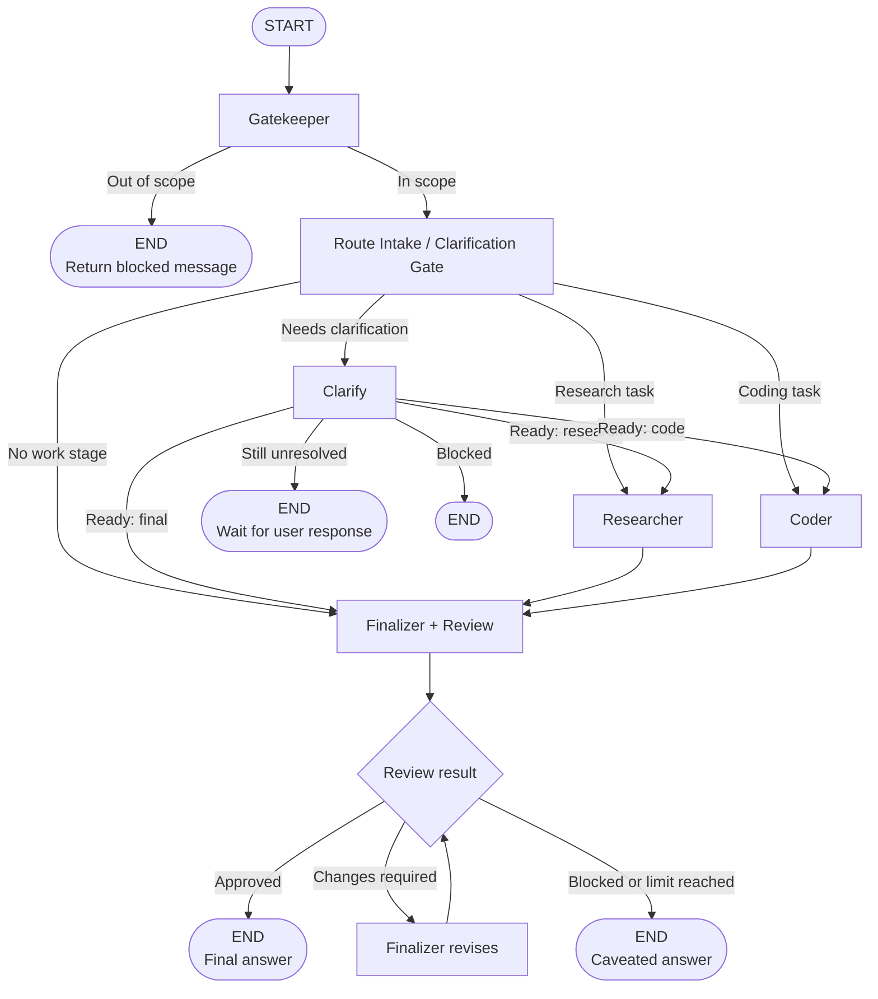
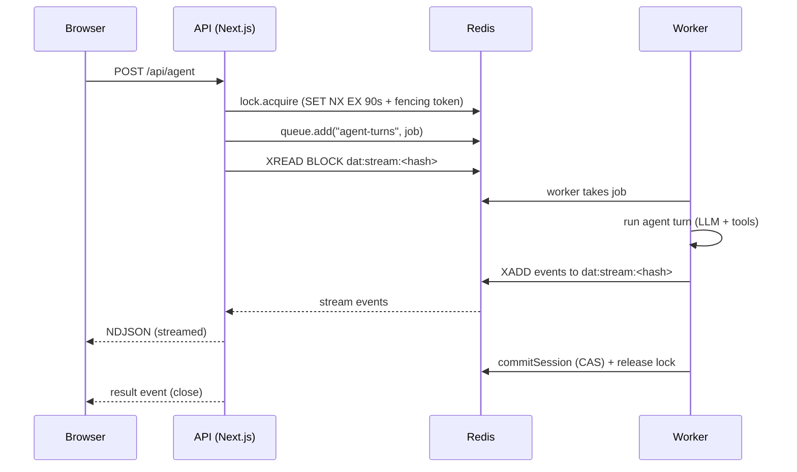

## API / Worker / Redis data flow

A single agent turn crosses three boundaries: browser -> API -> Redis -> worker -> Redis -> browser. The API never calls an LLM; it enqueues a BullMQ job and streams events from a per-session Redis Stream.

- A client disconnect does not kill the run. `POST /api/agent/reattach` resumes the stream from `afterEventId`.
- `POST /api/agent/cancel` sets a flag the worker polls (~500ms) and aborts cooperatively.
- See [`docs/worker-architecture.md`](worker-architecture.md) for isolation layers, scaling knobs, and timing constants.