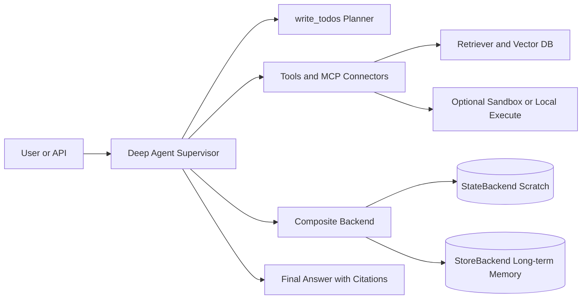
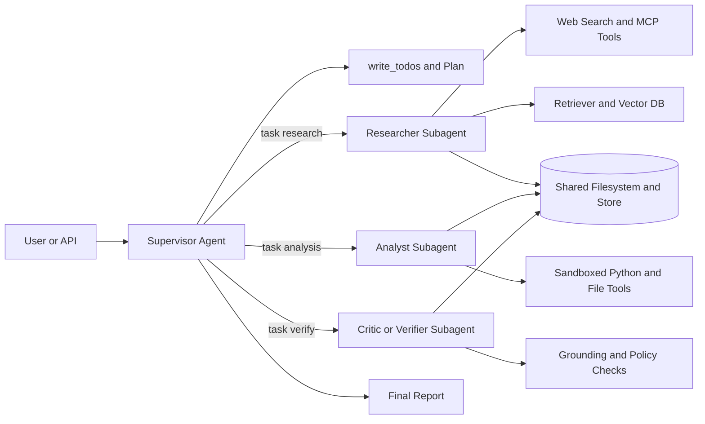
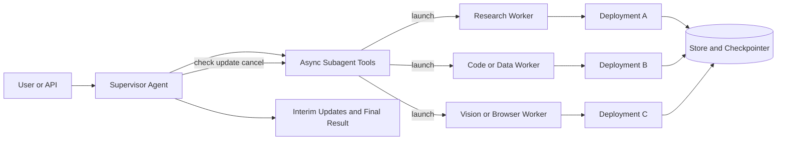
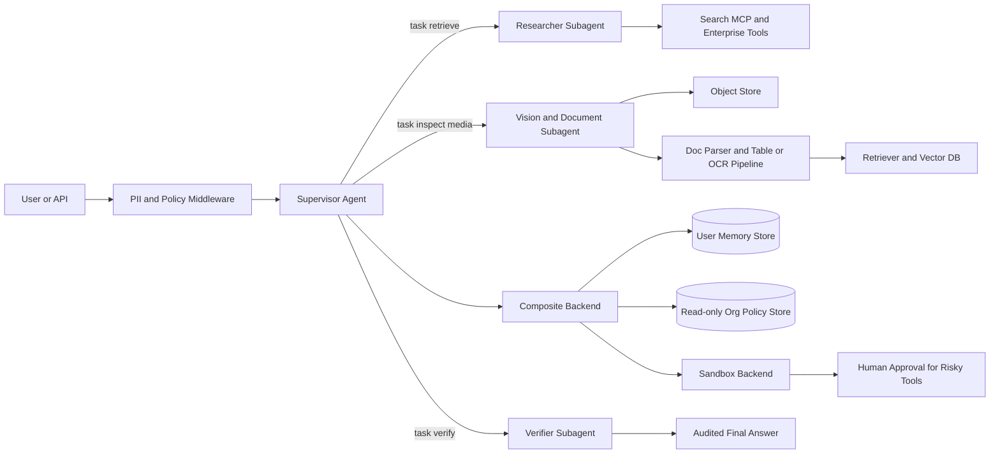

# Designing and Evaluating a Deep Agent with LangChain Deep Agents

## Executive summary

LangChain Deep Agents is a strong fit for long-horizon agents because it already bundles the capabilities that usually make “deep” systems hard to engineer by hand: a tool-calling loop, a virtual filesystem, built-in task planning, context offloading and summarisation, persistent memory, subagent delegation, human approval for sensitive actions, and production-oriented tracing and deployment through LangSmith and LangGraph. In the official docs, these are grouped into execution environment, context management, delegation, and steering, which is exactly the surface area you need to design a serious research, operations, or knowledge-work agent rather than a one-shot chatbot. citeturn8view6turn29view4

If your constraints are unspecified, the best default is **a supervisor with synchronous specialist subagents and an explicit verifier/critic stage**. That architecture stays close to how Deep Agents is meant to be used, preserves modularity, avoids premature distributed systems complexity, and directly addresses the two most common failure modes in deep agents: context bloat and unverified synthesis. The official subagent docs explicitly frame subagents as a tool for “context quarantine”, and LangChain’s TypeScript Deep Agent template already bakes in a “plan, delegate, critique, finalise” workflow with `researcher` and `critic` subagents. citeturn11view5turn31view0

For **model selection**, start with **model specialisation before fine-tuning**. The most useful split is: a cheaper summariser/compressor, a stronger planner/research model, and a strong final-writer or verifier. LangChain’s `open_deep_research` reference implementation already separates summarisation, research, compression, and final-report models, and its reported results show that model mix changes both RACE score and cost materially. Fine-tuning is worth considering later, especially for tool selection and argument filling, but only after you have stable tool schemas and real trace data; papers such as Gorilla and Agent-FLAN show that targeted tuning can improve API-call accuracy and reduce hallucinated tool use, especially when paired with retrieval over tool documentation. citeturn36view0turn36view2turn27search0turn28search0

For **evaluation**, do not rely on one benchmark or one judge model. Use a layered stack: offline datasets in LangSmith for regression, trajectory evaluation with AgentEvals, benchmark suites matched to your task mix, human review through annotation queues, and online evaluators on production traces. For deep-research style agents, the most relevant public suites today are DeepResearch Bench, DeepResearch Bench II, ResearcherBench, and DRBench; for general tool use and agent reliability, add GAIA, τ-bench, BFCL/APIBench, and AgentBench; for browser or computer-use tasks, add WebArena/BrowserGym/WorkArena and OSWorld; and for safety, include AgentDojo, InjecAgent, and ST-WebAgentBench. citeturn16view0turn14view1turn14view2turn33view0turn33view2turn34view0turn34view2turn25search3turn23search0turn32search1turn22search0turn22search7turn23search3turn23search1turn21search5turn21search0turn32search3

## What Deep Agents already gives you

You should design *with* the harness rather than around it. Deep Agents exposes tools, filesystem access, optional sandboxed code execution, skills, memory, summarisation, prompt caching, task planning, subagent spawning, and human-in-the-loop interrupts. The built-in planner is the `write_todos` tool, which persists a structured task list in state; context compression offloads large tool inputs and results to the filesystem, then summarises older history automatically once context approaches the model limit; and on Anthropic models, prompt caching is applied automatically to static prompt sections such as base instructions, memories, and skills. Those defaults are already a powerful baseline for deep work. citeturn13view0turn13view2turn13view6

The filesystem abstraction matters more than it first appears. Deep Agents’ file tools (`ls`, `read_file`, `write_file`, `edit_file`, `glob`, `grep`) all run against a pluggable backend, and `read_file` already supports common image formats as multimodal content. This means you can treat files as the agent’s durable working memory and offload medium-sized artefacts from the prompt into a search/read surface. The docs support `StateBackend`, `StoreBackend`, local filesystems, sandboxes, `ContextHubBackend`, and `CompositeBackend` routing, so a lot of architecture that would otherwise require bespoke middleware can be expressed as backend routing and namespace scoping instead. citeturn8view0turn11view2turn11view3

Memory should be designed very deliberately. The docs distinguish **thread-scoped short-term state** from **cross-thread long-term memory**, and the common long-term patterns are **user-scoped memory** and **agent-scoped memory**. For production multi-user systems, the most important design warning is that the legacy default storage namespace can cause all users of the same assistant to share storage; the official guidance is to provide your own namespace factory. The docs also warn that concurrent writes to the same memory file are last-write-wins, and recommend background consolidation or topic-split files when you expect parallel writes. citeturn8view1turn11view0turn11view4turn9view4

Multimodality is supported, but not magically solved. Deep Agents can ingest images through message content or `read_file`, yet the built-in context management is mainly text- and message-history-oriented: it does **not** resize images, lower resolution, or generate reusable visual embeddings. The official guidance is to keep large media out of active history, store images and charts in files or object stores, pass references rather than base64 blocks, and isolate image-heavy inspection work into subagents so the main agent receives compact text results. That recommendation should materially shape any architecture that claims to support multimodal input. citeturn13view3turn13view4

On deployment, the official recommendation for production is presently LangSmith-backed deployment paths. The production guide notes that LangSmith Deployment provisions threads, runs, a store, and a checkpointer, and adds authentication, webhooks, cron jobs, and observability. For async subagents, the docs recommend starting with a single deployment and in-process ASGI transport, then moving to split or hybrid deployments only when you need different compute profiles or independent scaling. citeturn9view17turn10view6turn10view9turn12view1turn12view3turn12view4turn12view5

LangChain’s own open-source examples are worth treating as architectural signals. `open_deep_research` explicitly separates summarisation, research, compression, and final writing models and evaluates against DeepResearch Bench; `async-deep-agents` shows a supervisor-worker background-job architecture on LangSmith Deployments; and the TypeScript `deep-agent-template-js` includes a plan/delegate/critique/finalise workflow, `researcher` and `critic` subagents, human approvals on `execute` and `write_file`, and test/eval scaffolding out of the box. citeturn36view2turn29view2turn31view0

## Candidate architectures

### Single harness baseline

This is the fastest route to a working deep agent and the right place to begin if you are still discovering the task and tool surface. It uses one Deep Agent with a modest toolset, a routed backend, and optional RAG. It is easy to build, easy to trace, and easy to evaluate, but it will eventually hit limits on context cleanliness, verification quality, and concurrency. The common “deep agent” patterns identified in LangChain’s own educational material—task planning, context offloading, and context isolation—start here, but only the first two are fully exploited in this architecture. citeturn29view1turn13view2turn13view6



**Component list.** Core agent via `create_deep_agent`; built-in planning with `write_todos`; routed backend with `/scratch` on `StateBackend` and `/memory` on `StoreBackend`; a small set of tools or MCP connectors; optional retriever/vector database as an external tool; optional sandbox only if code execution is genuinely required. The key design choice is to keep tool count low and tool schemas clean. Deep Agents supports custom callables, LangChain tools, and MCP servers directly, so tool sprawl is mostly a product decision, not a framework constraint. citeturn8view10turn8view0

**Data flow and state management.** User input enters the main agent, which creates or updates a todo list, calls tools, writes intermediate artefacts to the filesystem, and stores durable memory in a namespaced store. Use user-scoped namespaces for preferences and history; reserve agent-scoped memory for generally useful conventions; and keep organisation-wide policy memory read-only. If you later add background memory consolidation, the docs recommend a separate consolidation agent on a cron schedule rather than forcing all summarisation onto the hot path. citeturn11view0turn13view7turn11view1

**Model and retrieval choices.** Use one strong, tool-calling frontier model first. The Deep Agents models page currently highlights Claude 4.x, GPT-5.4 / GPT-4o / o3 / o4-mini / GPT-5.2-codex, Gemini 3.x previews, and several open-weight options as strong harness-compatible choices. Only add RAG if your corpus is large, changing, or proprietary; if you do, treat retrieval as a tool and return references or excerpts, not entire corpora. Do **not** fine-tune at this stage; the harness already gives you prompts, skills, profiles, offloading, and memory, which are lower-risk knobs to turn first. citeturn11view8turn11view9turn29view4

**Safety posture.** Restrict filesystem paths, avoid `execute` unless necessary, and enable human approval for obviously risky tools. If you do use interrupts, remember that a checkpointer is required for human-in-the-loop workflows. This architecture is appropriate when “unsafe action” mostly means file writes or outbound calls, not complex enterprise side effects. citeturn8view2turn11view7turn3view7

### Supervisor with specialist subagents

This is the best default architecture for most serious deep agents. A supervisor plans and routes work to context-isolated specialists such as `researcher`, `analyst`, `critic`, and `writer`. The crucial gain is not just modularity; it is **context hygiene**. The subagent docs explicitly motivate this pattern as a way to prevent large tool outputs and detailed intermediate work from polluting the main agent’s context, and the TypeScript Deep Agent template validates the same “researcher + critic” split in practice. citeturn11view5turn8view3turn31view0



**Component list.** Supervisor agent; synchronous subagents with narrow, action-oriented descriptions; shared filesystem/store routed by `CompositeBackend`; optional retriever and sandbox; verifier or critic stage; read-only policy memory; user-scoped working memory. Component boundaries should map to *failure modes*: the researcher handles exploration, the analyst handles computation or extraction, and the critic checks citations, groundedness, and policy before final synthesis. citeturn9view11turn8view0turn13view7

**Data flow and state management.** The supervisor decomposes the user request into todos, delegates focused subtasks, and only receives compact outputs from each specialist rather than the full trace of every search or file read. This is the architecture that most directly benefits from Deep Agents’ context offloading and summarisation because each specialist can go deep locally while the supervisor stays comparatively clean. For memory, use separate files per topic or per entity rather than one giant memory file; that reduces cross-task interference and avoids last-write-wins collisions if you later introduce more parallelism. citeturn13view6turn9view4

**Model and retrieval choices.** This is where model routing starts to pay for itself. A practical split is: cheap structured-output model for summarisation and compression; strong reasoning model for research and supervisor work; strong writer or verifier for the final pass. LangChain’s `open_deep_research` example does exactly this by separating summarisation, research, compression, and final-report models, and the repository’s evaluation setup shows that these choices affect both quality and cost. If you eventually fine-tune, fine-tune the *specialist* that exhibits repeated traceable failures—usually a router, a function-caller, or a citation verifier—rather than the whole system. citeturn36view2turn36view0turn27search0turn28search0

**Why this is the default recommendation.** It is the best trade-off across modularity, cost, latency, and maintainability. It remains simple enough to deploy as one graph, but gives you a place to add verification, memory scopes, and tool-specific prompts without dissolving into one giant system prompt. For most applications, you should exhaust this design space before moving to async multi-deployment orchestration. citeturn12view3turn8view6

### Async distributed agent mesh

Use this when tasks are slow, parallel, or person-in-the-loop over long periods. The Deep Agents async subagent pattern is explicitly a supervisor-worker design for non-blocking background work, supporting launch, check, update, cancel, and list semantics, with each job implemented as a standard LangGraph run on its own thread. The official docs cover ASGI co-deployed transport, remote HTTP transport, and single, split, or hybrid deployment topologies. citeturn29view2turn12view0turn12view1turn12view2



**Component list.** One supervisor; several async subagent types; per-worker deployment or runtime; shared store and checkpointer; worker-specific toolsets and sandboxes; tracing keyed by thread IDs. This is where you can justify heterogeneous compute, such as a heavy browser worker, a lighter planning supervisor, and a specialised code worker. The docs explicitly note that HTTP transport is useful when workers need independent scaling, different resource profiles, or different ownership. citeturn12view1turn12view2

**Data flow and state management.** The supervisor launches jobs and does not need to block until completion. A launch creates a new thread on the server and returns a thread ID as the task ID; later checks retrieve status and, on success, collect the worker’s output. LangSmith traces are particularly valuable here because the supervisor’s trace and each worker’s trace are linked by thread ID, which makes debugging orchestration failures much easier than in ad hoc queue-based systems. In local development, remember that every active run takes a worker slot, so the worker pool must be sized to include the supervisor plus all concurrent workers. citeturn12view6turn12view8turn12view7

**Model and deployment choices.** Use an inexpensive supervisor and spend budget on workers only when they are launched. Co-deploy via ASGI first because the docs recommend it as the default: you get zero network latency and simpler auth while preserving per-thread state isolation. Split deployments only when scale or runtime heterogeneity actually demands it. This architecture also pairs well with long-running memory consolidation agents, report-generation jobs, or review workflows that span hours or days. citeturn12view1turn12view3turn10view9turn11view1

**Trade-off.** You gain concurrency, elasticity, and resumability, but pay with higher operational complexity and more state edges. If your users mostly wait synchronously for one answer, this is usually overkill. citeturn12view3turn29view2

### Safety-critical multimodal enterprise

This is the right design when the agent must handle documents, charts, screenshots, or rich private data; when its tools can cause irreversible changes; or when the environment is regulated. Deep Agents can support this well, but only if you take the framework’s guardrails and multimodal caveats seriously: large media should live in files or object stores, org-level policy memory should be read-only, and code execution should happen inside sandboxes with restricted secrets and, ideally, restricted network access. citeturn13view4turn13view7turn8view7turn9view14



**Component list.** Supervisor; researcher, vision/document, and verifier subagents; object store plus parser/OCR/table extraction pipeline; retriever/vector store; `CompositeBackend` routing scratch, user memory, and read-only policy memory; sandbox backend for execution; human approval for risky tools; resilience middleware for retries, fallback, and PII handling. The production guide shows concrete retry, fallback, tool-retry, and PII middleware patterns, and the docs emphasise that sandboxes are essential because autonomous agents can generate code and shell commands you cannot predict in advance. citeturn10view1turn10view3turn8view7

**Data flow and state management.** Media and documents are stored outside the active message history and only referenced in prompts or read via file paths/URLs. The vision subagent produces compact text artefacts that can be indexed or handed to the verifier. Policies should sit in an organisation-level, read-only namespace so the agent cannot rewrite its own safety envelope through shared state. Long-term user memory lives in a separate user-scoped namespace. This separation is a direct consequence of the docs’ warning about shared namespaces and their recommendation that organisation memory usually be read-only. citeturn13view4turn11view4turn13view7

**Model and retrieval choices.** Use a strong text model for planning and synthesis, a strong multimodal model for document/chart/image inspection, and a verifier with structured-output reliability. Because Deep Agents does not create reusable visual embeddings itself, use an explicit document parsing and retrieval layer for PDF/DOCX/image-heavy data. Evaluate embedding models and chunking against your own corpus rather than assuming one vendor default will generalise; this is exactly the kind of ablation RAGBench and T²-RAGBench are meant to drive. citeturn13view3turn24search3turn24search11

**Trade-off.** This is the safest and most extensible architecture here, but it is also the most expensive to design, evaluate, and operate. Use it when the harm of a wrong action is much bigger than the inconvenience of more infrastructure. citeturn8view7turn8view2

## Architecture comparison and recommendation

The table below is a synthesis of the framework capabilities and benchmark evidence above. The complexity, cost, and latency columns are relative engineering estimates rather than published benchmark numbers.

| Architecture | Pros | Cons | Relative complexity | Relative cost | Relative latency | Best use-cases |
|---|---|---|---|---|---|---|
| Single harness baseline | Fastest to build; smallest operational surface; easy tracing and regression testing | Context gets dirty quickly; weaker verification; limited concurrency | Low | Low to medium | Low | Early prototypes, internal copilots, narrow workflows |
| Supervisor with specialist subagents | Best modularity/clarity trade-off; cleaner context; natural place for critic/verifier; easiest serious architecture to operate | Slightly higher orchestration overhead; still mostly synchronous | Medium | Medium | Medium | Most deep agents: research, knowledge work, analyst assistants |
| Async distributed agent mesh | True concurrency; resumable long jobs; heterogeneous compute per worker; scales by worker type | Harder state management; tracing and deployment more complex; more failure modes | High | Medium to high | Medium for user-facing orchestration, high for full task completion | Background research, coding pipelines, batch analysis, multi-hour tasks |
| Safety-critical multimodal enterprise | Strongest safety posture; handles rich private data and multimodal evidence; best auditability | Highest infra burden; more components to evaluate and secure | Very high | High | High | Regulated or high-risk workflows, enterprise research, document-heavy operations |

The practical recommendation is simple. **Start with the supervisor + specialist-subagent architecture** as your main line. Keep a smaller single-harness baseline as a control. Only move to async when concurrency or task duration becomes the bottleneck, and only adopt the safety-critical multimodal stack if your domain truly needs it. This sequence mirrors the Deep Agents docs, which recommend starting with a single deployment for async work, and it also aligns with the open-source examples from LangChain, which begin with synchronously orchestrated research, critique, and reporting patterns before distributed orchestration. citeturn12view3turn31view0turn36view2turn29view2

My default implementation choice would therefore be:

1. **Prototype:** single-harness baseline.  
2. **Primary build:** supervisor + `researcher`, `analyst`, `critic` synchronous subagents.  
3. **Scale-out path:** async subagents for long-running, browser, or compute-heavy tasks.  
4. **Hardening path:** multimodal parsers, read-only policy memory, sandbox restrictions, PII middleware, and human approval for risky tools. citeturn11view5turn10view1turn8view7turn8view2

## Evaluation framework

### Metrics that matter

A serious evaluation stack needs to measure **outcomes**, **trajectory quality**, **evidence quality**, **resource efficiency**, **robustness**, and **human preference**. LangSmith’s own guidance separates final-response, trajectory, and single-step evaluations; τ-bench adds reliability through `pass^k`; DeepResearch Bench contributes report-quality and citation metrics through RACE and FACT; DeepResearch Bench II decomposes long-form research quality into information recall, analysis, and presentation via fine-grained rubrics; ResearcherBench adds faithfulness and groundedness; and ST-WebAgentBench contributes policy-aware safety metrics such as Completion under Policy and Risk Ratio. citeturn14view1turn23search0turn33view0turn33view2turn34view0turn32search3turn32search7

| Metric family | Recommended metrics | Why it matters |
|---|---|---|
| Final task outcome | Task success rate, exact match where possible, rubric score, pairwise win rate | Measures whether the user actually got the job done |
| Reliability | `pass^k`, variance across seeds, retry-adjusted success | Detects brittle agents that “sometimes work” |
| Trajectory quality | Tool selection accuracy, argument validity, unnecessary-tool-call rate, step count, recovery rate after tool failure | Distinguishes lucky answers from robust agent behaviour |
| Retrieval and evidence | Recall@k, nDCG@k, citation precision, citation recall, citation accuracy, evidence coverage | Essential for research, RAG, and enterprise assistants |
| Report quality | Recall / analysis / presentation rubric scores; structure completeness | Necessary for long-form deep-research outputs |
| Memory quality | Memory hit rate, stale-memory rate, cross-user leakage rate, memory overwrite conflict rate | Prevents personalisation from becoming contamination |
| Safety and policy | Attack success rate, policy-compliant completion, risk ratio, unsafe-action interception rate, human override precision | Critical when tools can change data or exfiltrate information |
| Multimodal quality | DocVQA / ChartQA / MMMU accuracy; evidence grounding for images/tables | Tests image, document, and chart understanding |
| Operations | Median and p95 latency, token use, run cost, timeout rate, fallback rate | Governs whether the system is viable in production |
| Human preference | Helpfulness, clarity, trust, edit distance from accepted human revision, reviewer agreement | Captures subjective quality not visible in automatic metrics |

For deep agents specifically, I recommend a **release scorecard** built from weighted summary metrics rather than one monolithic score. A good default is: 35% final task success, 20% evidence/citation quality, 15% trajectory quality, 10% reliability, 10% safety, and 10% operations. If your use-case is research-heavy, shift more weight toward evidence and report quality; if it is action-heavy, shift more weight toward trajectory quality and safety. That weighting is an engineering choice, but the categories themselves are well grounded in the benchmark ecosystem above. citeturn14view1turn23search0turn33view0turn33view2turn32search3

### Benchmark portfolio

Use a **portfolio**, not a single benchmark. Each suite stresses a different subsystem.

| Benchmark | Use it for | Why it is valuable | Source |
|---|---|---|---|
| DeepResearch Bench | Long-form web research reports | 100 PhD-level tasks across 22 fields; RACE and FACT cover report quality and citation trustworthiness | citeturn33view0turn33view1 |
| DeepResearch Bench II | Fine-grained deep-research diagnosis | 132 tasks and 9,430 binary rubrics across information recall, analysis, and presentation; official multimodal eval pipeline | citeturn33view2turn35view0 |
| ResearcherBench | Frontier scientific/consulting research | 65 research questions across 35 AI subjects with rubric and factual assessment | citeturn34view0turn34view1 |
| DRBench | Enterprise deep research | Public + private knowledge sources; realistic enterprise personas and contexts | citeturn34view2turn34view4 |
| GAIA | General assistant capability | Real-world questions requiring reasoning, tool use, browsing, and multimodality | citeturn25search3 |
| τ-bench | Dynamic tool-agent-user interaction | Adds domain rules and multi-turn reliability, including `pass^k` | citeturn23search0 |
| BFCL V4 / APIBench | Function calling | Directly probes tool selection, schema adherence, and hallucination in tool use | citeturn32search1turn32search21turn32search4 |
| AgentBench | Broad agent competence | Multiple environments for reasoning and acting | citeturn22search0 |
| WebArena / BrowserGym / WorkArena / BrowserArena | Browser agents | Sandboxed realism, enterprise workflows, and live open-web behaviour | citeturn22search7turn23search3turn23search2turn32search10 |
| OSWorld | Computer-use multimodal agents | Real operating-system tasks with execution-based evaluation | citeturn23search1 |
| AgentDojo / InjecAgent / ST-WebAgentBench | Safety and trustworthiness | Prompt injection, policy compliance, enterprise web safety, and attack success | citeturn21search5turn21search0turn32search3turn32search7 |
| RAGBench / T²-RAGBench | Retrieval ablations | Domain RAG, text-and-table retrieval, embedding and chunking choices | citeturn24search3turn24search11turn24search15 |
| DocVQA / ChartQA / MMMU | Multimodal documents and charts | Tests document QA, chart reasoning, and broad multimodal reasoning | citeturn24search2turn24search1turn24search0turn24search12 |
| SWE-bench | Code-modifying agents | Real repository issues and execution-checked outcomes | citeturn22search2turn22search14 |

For a general-purpose deep agent with unknown future scope, I would start with a **core set** of DeepResearch Bench, DeepResearch Bench II, τ-bench, BFCL V4, AgentDojo, and one browser or computer-use benchmark relevant to your tool surface. Then add RAGBench or DocVQA/ChartQA only if your real workload truly involves retrieval-heavy corpora or multimodal documents. citeturn33view0turn35view0turn23search0turn32search1turn21search5turn23search3turn23search1

### Automated pipelines, prompts, and scoring scripts

LangSmith’s official evaluation framework is well suited to deep agents because it supports offline datasets, target functions, code evaluators, LLM-as-a-judge evaluators, trajectory evaluation, online evaluators, and CI/CD quality gates. The docs explicitly recommend offline evaluation for benchmarking, regression, unit testing, and backtesting before deployment, and online evaluation for real-time monitoring on production traces after release. citeturn16view0turn16view1turn14view10turn14view6

A practical **offline evaluation target function** is a wrapper around your agent that returns at least the final response and any structured artefacts you want to score, such as citations, route choice, or trajectory. LangSmith’s docs define the three required pieces as a dataset, a target function, and evaluators, while the complex-agent tutorial recommends evaluating final response, trajectory, and isolated single steps. citeturn14view10turn14view1

```python
from langsmith import evaluate
from agentevals.trajectory.match import create_trajectory_match_evaluator
from my_agent import run_agent  # your wrapper

def target(inputs: dict) -> dict:
    result = run_agent(inputs["question"])
    return {
        "response": result["response"],
        "trajectory": result.get("trajectory", []),
        "citations": result.get("citations", []),
        "route": result.get("route"),
    }

def citation_metrics(outputs: dict, reference_outputs: dict):
    pred = set(outputs.get("citations", []))
    gold = set(reference_outputs.get("citations", []))
    precision = len(pred & gold) / max(len(pred), 1)
    recall = len(pred & gold) / max(len(gold), 1)
    return [
        {"key": "citation_precision", "score": precision},
        {"key": "citation_recall", "score": recall},
    ]

trajectory_eval = create_trajectory_match_evaluator()

results = evaluate(
    target,
    data="deep-agent-golden-set",
    evaluators=[citation_metrics, trajectory_eval],
    experiment_prefix="deep-agent-pr-123",
)
```

That structure is faithful to LangSmith’s model: define a target function, then attach code or LLM-as-a-judge evaluators. AgentEvals is the official open-source companion for trajectory scoring, and LangSmith supports multiple scores from one evaluator, which is useful for returning precision/recall pairs or separate rubric dimensions in one pass. citeturn14view10turn14view2turn17search6turn17search22

For **trajectory scoring**, use deterministic trajectory match wherever you have a well-defined workflow; it is faster and cheaper than an LLM judge. The trajectory docs explicitly recommend hard-coded reference trajectories when expected behaviour is known and note that you can customise equality rules for tool argument matching. Use LLM judges for open-ended research or writing flows, but audit their scores regularly. citeturn15view6turn14view2turn17search3

For **judge prompts**, keep them narrow and rubric-based. Two prompts are especially useful:

```text
Synthetic task generation prompt
You are generating a benchmark case for a deep agent.
Given:
- tool schemas
- policy rules
- domain documents
Generate:
- one realistic user request
- one hidden gold answer
- one acceptable tool trajectory
- 3 disallowed actions
- 3 difficulty tags
- evaluation rubrics for correctness, evidence quality, and safety
Return JSON only.
```

```text
LLM-as-a-judge rubric prompt
Score the agent output on:
1. correctness
2. citation_grounding
3. policy_compliance
4. report_structure
For each item return:
- score: 0 or 1
- short reason
- direct evidence from the output
Do not infer facts that are not present.
Return JSON only.
```

These are my recommended templates rather than official LangSmith prompts, but they fit LangSmith’s evaluator model well: rubric-driven, structured, and auditable. LangSmith’s LLM-as-a-judge docs emphasise explicit feedback configurations and note that few-shot examples often improve evaluator reliability. citeturn17search13turn17search14turn16view2

For **pytest-driven evals**, the official integration is excellent for regression suites because test cases can sync into LangSmith datasets and automatically create experiments on run. This is especially useful if you already have an engineering culture around `pytest`. citeturn14view3turn15view8

```python
import pytest
from my_agent import run_agent

@pytest.mark.langsmith(output_keys=["response"])
@pytest.mark.parametrize("question, expected", [
    ("Find the policy on remote work", "remote work policy"),
    ("Summarise the Q4 board pack", "Q4 board pack summary"),
])
def test_agent_smoke(question, expected):
    result = run_agent(question)
    assert expected.lower() in result["response"].lower()
```

### Ablations and human review

Your ablation plan should target **architectural hypotheses**, not random knobs. The highest-value ablations for a Deep Agents system are usually:

| Ablation | What it tests | Why it is useful |
|---|---|---|
| Single harness vs synchronous subagents | Value of context isolation | Directly tests whether subagents reduce bloat and improve outcome quality |
| No critic vs critic/verifier | Value of explicit verification | Measures whether final synthesis improves with a dedicated check stage |
| Single model vs split models | Value of model specialisation | Tests whether cheaper summarisation plus stronger reasoning improves cost–quality trade-off |
| No RAG vs RAG | Value of external grounding | Shows whether retrieval really helps on your domain |
| No memory vs user memory vs agent memory | Value and risk of persistence | Reveals leakage, staleness, or useful personalisation |
| No consolidation vs background consolidation | Memory quality under growth | Tests latency and memory conflict trade-offs |
| No HITL vs selective HITL | Cost of safety gates | Measures whether approvals catch meaningful risk or just add friction |
| Sandbox unrestricted vs network-restricted | Security hardening | Tests exfiltration and misuse resistance |
| Text-only vs full multimodal path | Multimodal ROI | Determines whether document and image handling changes outcome quality |

These ablations are not arbitrary. They line up with the framework’s built-in levers—subagents, memory scopes, consolidation, sandboxes, human interrupts, and model routing—and with the literature on reflection, tool-interactive critique, and memory hierarchy. Reflexion, Self-Refine, CRITIC, and MemGPT all support the broader design intuition that explicit reflection, verification, and memory management can improve long-horizon agent performance without immediately resorting to full end-to-end fine-tuning. citeturn11view5turn11view1turn8view7turn8view2turn26search0turn26search1turn26search2turn19search4

For **human evaluation**, use two lanes. First, use **single-run annotation queues** with a rubric for correctness, groundedness, helpfulness, and trust. Second, use **pairwise queues** for A/B comparisons between architecture variants or model mixes. LangSmith’s evaluation docs explicitly describe annotation queues as a structured mechanism for collecting reviewer feedback and turning reviewed runs into future datasets, and pairwise comparison is supported both in the UI and via evaluation APIs. I would require dual review on at least the sampled failures and any high-risk task category, then adjudicate disagreements and export corrected runs back into offline datasets. citeturn16view3turn16view5turn17search0turn17search1turn17search8

## Experiment plan and CI/CD

The best next steps are not “add more tools”; they are **staged architecture and evaluation decisions**. I would run the following plan.

| Phase | Goal | Concrete deliverable |
|---|---|---|
| Baseline | Prove the task is worth agentifying | Single-harness baseline with LangSmith tracing, 20–30 gold tasks, and 50–100 synthetic tasks |
| Modularise | Clean up context and add verification | Supervisor + `researcher` + `critic` subagents, routed memory namespaces, citation evaluator |
| Ground | Decide whether external retrieval is essential | RAG/no-RAG comparison, embedding and chunking ablations, evidence metrics |
| Harden | Add safety and operational resilience | Sandbox, selective HITL, retry/fallback middleware, PII middleware, injection tests |
| Scale | Introduce async only if justified | Async worker for the slowest or most parallel subtask; thread-ID correlated tracing |
| Release | Establish continuous quality control | CI quality gate, online evaluators, annotation queue for negative feedback, canary thresholds |

This sequence is intentionally conservative. It follows the Deep Agents philosophy of beginning with the built-in harness and escalating only when the measured bottleneck is clear. It also mirrors LangSmith’s lifecycle: offline evaluation during development, online evaluation after deployment, then a feedback loop from production traces into datasets and annotation queues. citeturn16view0turn16view1turn14view4turn14view8

For **CI/CD**, I recommend three classes of checks on every pull request:

1. **Fast tests**: unit tests for tools, parsers, and backend routing.  
2. **Smoke evals**: a small LangSmith offline dataset and deterministic trajectory checks.  
3. **Quality gate**: fail the build if a weighted score or minimum accuracy threshold is missed.  

LangSmith’s CI/CD example and local-results documentation explicitly show how to fail a build based on evaluation thresholds, and the TypeScript deep-agent template already includes unit, integration, and `test:eval` scripts. citeturn14view4turn14view9turn31view0

```yaml
name: deep-agent-ci

on:
  pull_request:
  push:
    branches: [main]

jobs:
  test-and-eval:
    runs-on: ubuntu-latest
    steps:
      - uses: actions/checkout@v4
      - uses: actions/setup-python@v5
        with:
          python-version: "3.11"
      - run: pip install -r requirements.txt
      - run: pytest -m "not slow"
      - run: python evals/run_offline_eval.py
      - run: python evals/quality_gate.py
```

A corresponding quality-gate script can be as simple as the official LangSmith pattern: pull experiment results, compute an aggregate score, and exit non-zero below threshold. Start with conservative gates on pull requests and stricter gates on main or pre-release branches. citeturn14view9

For **production monitoring**, add online evaluators only where they pay for themselves. LangSmith’s online evaluator docs allow you to filter by traces that used specific tools or metadata and to sample only a fraction of runs, which is ideal for high-cost judges. My recommendation is to run online evaluators on: negative user feedback, risky tool invocations, multimodal tasks, and any run that triggered retries or fallbacks. Route the worst traces into an annotation queue automatically. citeturn14view7turn14view8turn14view6

If you are building in **TypeScript**, you can accelerate this plan by starting from `deep-agent-template-js`, which already includes a plan/delegate/critique/finalise workflow, `researcher` and `critic` subagents, human interrupts on `execute` and `write_file`, and Vitest-based unit, integration, and evaluation commands. If you are building in **Python**, the closest official reference is `open_deep_research`, especially if your agent resembles a research assistant. citeturn31view0turn36view2

## Open questions and limitations

A few things remain inherently context-dependent. First, your **domain** will determine whether memory is mostly a convenience feature or a primary capability. Second, your **tool surface** will determine whether soft guardrails are sufficient or whether you need the full safety-critical architecture with read-only policy memory, network-restricted sandboxes, and frequent human approvals. Third, current benchmark ecosystems are strong but still fragmented: research agents, browser agents, computer-use agents, and safety benchmarks each capture different failure modes, so you will need a portfolio rather than one canonical number. citeturn13view7turn8view7turn23search3turn21search5turn32search3

There is also a time-sensitive limitation: current model recommendations and benchmark leaderboards change quickly. The Deep Agents models page is useful for identifying harness-compatible model families, but even the official docs warn that passing the Deep Agents eval suite is necessary but not sufficient for strong long-horizon performance. Treat all provider and model decisions as empirical questions to be re-benchmarked in your own CI rather than fixed truths. citeturn11view8